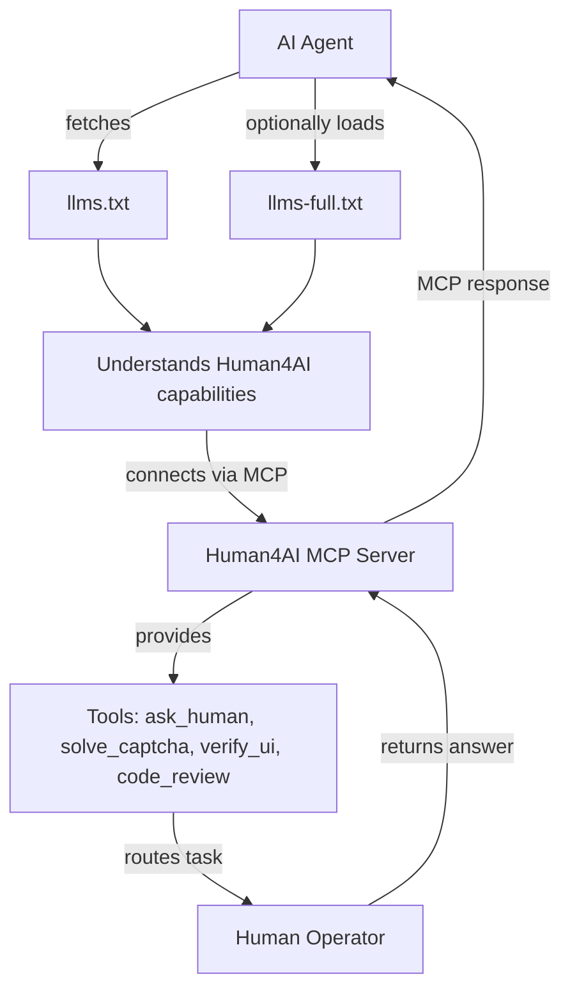

# Human4AI – LLMs.txt Files

This repository contains the **`llms.txt`** and **`llms-full.txt`** files for [Human4AI](https://human4.ai).

---

## What is this?

Large language models (LLMs) increasingly read and reason over online documentation.  
The **`llms.txt` standard** (see [llmstxt.org](https://llmstxt.org)) is a community proposal — similar to `robots.txt` or `sitemap.xml` — designed to help AI agents **understand how to use a product or service**.

- **`llms.txt`**: A **structured, concise index** of the most important resources, organized by sections (overview, quickstart, integration, use cases, developer docs, etc.).  
- **`llms-full.txt`**: A **detailed inline version** that includes actual descriptions, tool schemas, and example requests/responses. It lets an AI agent load all relevant knowledge in one file without needing to crawl external docs.  

---

## Why does Human4AI provide these files?

Human4AI is a **Human-in-the-Loop (HITL) service for AI agents**, delivered via the [Model Context Protocol (MCP)](https://modelcontextprotocol.io).  
Our MCP server enables AI agents to seamlessly request **human input, verification, and judgment** in real time.

These files exist to make Human4AI **AI-discoverable and usable**:

- Help AI assistants (Claude, ChatGPT, Cursor, LangGraph, etc.) quickly **understand what Human4AI is**.  
- Provide a **map of capabilities**: e.g., `ask_human`, `solve_captcha`, `verify_ui`, `code_review`.  
- Show **how to connect to our MCP server**, authenticate, and invoke tools.  
- Reduce the risk of AI models hallucinating by pointing them to **authoritative, structured content**.  

---

## Files in this repo

- [`llms.txt`](./llms.txt) – Concise index of Human4AI documentation.  
  - Public URL: [https://human4.ai/llms.txt](https://human4.ai/llms.txt)  
- [`llms-full.txt`](./llms-full.txt) – Detailed inline documentation with examples and tool schemas.  
  - Public URL: [https://human4.ai/llms-full.txt](https://human4.ai/llms-full.txt)  

---

## How AI agents use this

1. The AI agent fetches `llms.txt` (or `llms-full.txt`) to learn what Human4AI is and how to use it.  
2. The agent connects to the **Human4AI MCP server**.  
3. It discovers available tools (e.g., `ask_human`, `verify_ui`).  
4. The agent invokes a tool → Human operator performs the task.  
5. The result flows back to the AI agent through the MCP response.  

---

## Learn more

- Human4AI: [https://human4.ai](https://human4.ai)  
- LLMs.txt Proposal: [https://llmstxt.org](https://llmstxt.org)  
- MCP Specification: [https://modelcontextprotocol.io](https://modelcontextprotocol.io)  

---
